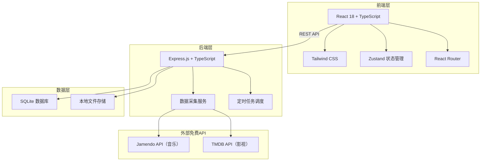
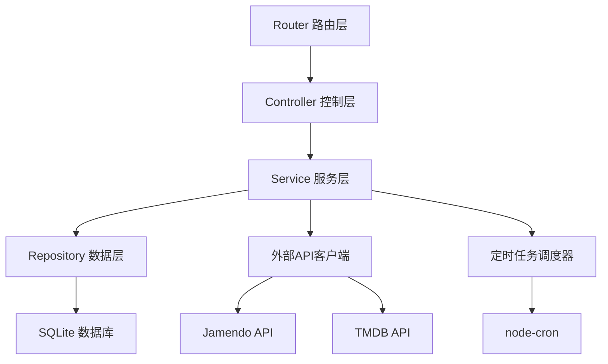
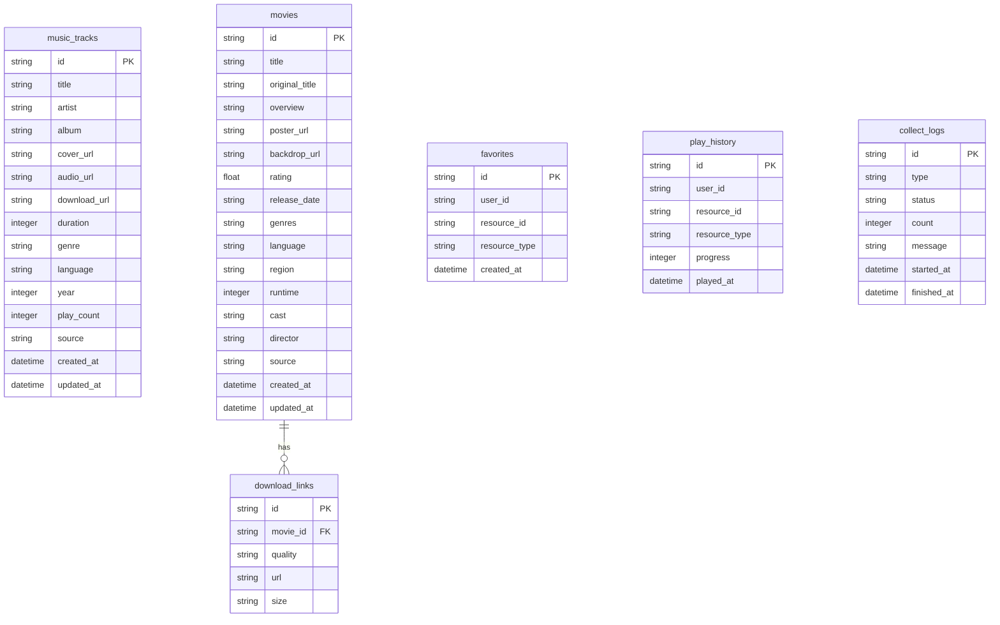

## 1. 架构设计



## 2. 技术说明

- **前端**：React@18 + Tailwind CSS@3 + Vite + TypeScript
- **初始化工具**：vite-init（react-express-ts 模板）
- **后端**：Express@4 + TypeScript（ESM格式）
- **数据库**：SQLite（轻量级，无需额外安装）
- **状态管理**：Zustand
- **路由**：React Router DOM
- **图标**：lucide-react
- **动画**：CSS Animations + Framer Motion
- **数据源**：
  - 音乐：Jamendo API（免费音乐API，提供CC协议音乐）
  - 影视：TMDB API（免费影视信息API，提供元数据）
- **定时采集**：node-cron 实现每日定时任务

## 3. 路由定义

| 路由 | 用途 |
|------|------|
| / | 首页，展示每日推荐和热门内容 |
| /music | 音乐专区，分类浏览和搜索 |
| /music/:id | 音乐详情页，播放和下载 |
| /movie | 影视专区，分类浏览和搜索 |
| /movie/:id | 影视详情页，信息和下载 |
| /search | 全局搜索页 |
| /profile | 个人中心，收藏和历史 |

## 4. API定义

### 4.1 音乐相关API

```typescript
interface MusicTrack {
  id: string;
  title: string;
  artist: string;
  album: string;
  coverUrl: string;
  audioUrl: string;
  downloadUrl: string;
  duration: number;
  genre: string;
  language: string;
  year: number;
  playCount: number;
  source: string;
  createdAt: string;
}

// GET /api/music - 获取音乐列表
interface GetMusicListRequest {
  page?: number;
  limit?: number;
  genre?: string;
  language?: string;
  year?: number;
  sort?: 'latest' | 'popular' | 'name';
}

interface GetMusicListResponse {
  tracks: MusicTrack[];
  total: number;
  page: number;
  totalPages: number;
}

// GET /api/music/:id - 获取音乐详情
// GET /api/music/search?q=keyword - 搜索音乐
```

### 4.2 影视相关API

```typescript
interface MovieItem {
  id: string;
  title: string;
  originalTitle: string;
  overview: string;
  posterUrl: string;
  backdropUrl: string;
  rating: number;
  releaseDate: string;
  genres: string[];
  language: string;
  region: string;
  runtime: number;
  cast: string[];
  director: string;
  downloadLinks: DownloadLink[];
  source: string;
  createdAt: string;
}

interface DownloadLink {
  quality: string;
  url: string;
  size: string;
}

// GET /api/movies - 获取影视列表
interface GetMovieListRequest {
  page?: number;
  limit?: number;
  genre?: string;
  region?: string;
  year?: number;
  sort?: 'latest' | 'rating' | 'popular';
}

interface GetMovieListResponse {
  movies: MovieItem[];
  total: number;
  page: number;
  totalPages: number;
}

// GET /api/movies/:id - 获取影视详情
// GET /api/movies/search?q=keyword - 搜索影视
```

### 4.3 首页相关API

```typescript
// GET /api/home - 获取首页数据
interface HomeData {
  featured: (MusicTrack | MovieItem)[];
  hotMusic: MusicTrack[];
  hotMovies: MovieItem[];
  latestMusic: MusicTrack[];
  latestMovies: MovieItem[];
}
```

### 4.4 用户相关API

```typescript
// GET /api/user/favorites - 获取收藏列表
// POST /api/user/favorites - 添加收藏
// DELETE /api/user/favorites/:id - 删除收藏
// GET /api/user/history - 获取播放历史
// POST /api/user/history - 添加播放历史
```

### 4.5 数据采集API

```typescript
// POST /api/collect/music - 手动触发音乐采集
// POST /api/collect/movies - 手动触发影视采集
// GET /api/collect/status - 获取采集状态
```

## 5. 服务器架构图



## 6. 数据模型

### 6.1 数据模型定义



### 6.2 数据定义语言

```sql
CREATE TABLE music_tracks (
  id TEXT PRIMARY KEY,
  title TEXT NOT NULL,
  artist TEXT NOT NULL,
  album TEXT DEFAULT '',
  cover_url TEXT DEFAULT '',
  audio_url TEXT DEFAULT '',
  download_url TEXT DEFAULT '',
  duration INTEGER DEFAULT 0,
  genre TEXT DEFAULT '',
  language TEXT DEFAULT '',
  year INTEGER DEFAULT 0,
  play_count INTEGER DEFAULT 0,
  source TEXT DEFAULT 'jamendo',
  created_at DATETIME DEFAULT CURRENT_TIMESTAMP,
  updated_at DATETIME DEFAULT CURRENT_TIMESTAMP
);

CREATE TABLE movies (
  id TEXT PRIMARY KEY,
  title TEXT NOT NULL,
  original_title TEXT DEFAULT '',
  overview TEXT DEFAULT '',
  poster_url TEXT DEFAULT '',
  backdrop_url TEXT DEFAULT '',
  rating REAL DEFAULT 0,
  release_date TEXT DEFAULT '',
  genres TEXT DEFAULT '',
  language TEXT DEFAULT '',
  region TEXT DEFAULT '',
  runtime INTEGER DEFAULT 0,
  cast TEXT DEFAULT '',
  director TEXT DEFAULT '',
  source TEXT DEFAULT 'tmdb',
  created_at DATETIME DEFAULT CURRENT_TIMESTAMP,
  updated_at DATETIME DEFAULT CURRENT_TIMESTAMP
);

CREATE TABLE download_links (
  id TEXT PRIMARY KEY,
  movie_id TEXT NOT NULL,
  quality TEXT NOT NULL,
  url TEXT NOT NULL,
  size TEXT DEFAULT '',
  FOREIGN KEY (movie_id) REFERENCES movies(id)
);

CREATE TABLE favorites (
  id TEXT PRIMARY KEY,
  user_id TEXT DEFAULT 'default',
  resource_id TEXT NOT NULL,
  resource_type TEXT NOT NULL CHECK(resource_type IN ('music', 'movie')),
  created_at DATETIME DEFAULT CURRENT_TIMESTAMP
);

CREATE TABLE play_history (
  id TEXT PRIMARY KEY,
  user_id TEXT DEFAULT 'default',
  resource_id TEXT NOT NULL,
  resource_type TEXT NOT NULL CHECK(resource_type IN ('music', 'movie')),
  progress INTEGER DEFAULT 0,
  played_at DATETIME DEFAULT CURRENT_TIMESTAMP
);

CREATE TABLE collect_logs (
  id TEXT PRIMARY KEY,
  type TEXT NOT NULL CHECK(type IN ('music', 'movie')),
  status TEXT NOT NULL CHECK(status IN ('running', 'success', 'failed')),
  count INTEGER DEFAULT 0,
  message TEXT DEFAULT '',
  started_at DATETIME DEFAULT CURRENT_TIMESTAMP,
  finished_at DATETIME
);

CREATE INDEX idx_music_genre ON music_tracks(genre);
CREATE INDEX idx_music_language ON music_tracks(language);
CREATE INDEX idx_music_created ON music_tracks(created_at);
CREATE INDEX idx_movies_genres ON movies(genres);
CREATE INDEX idx_movies_region ON movies(region);
CREATE INDEX idx_movies_created ON movies(created_at);
CREATE INDEX idx_favorites_user ON favorites(user_id, resource_type);
CREATE INDEX idx_history_user ON play_history(user_id, played_at);
```
